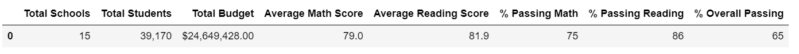
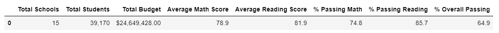
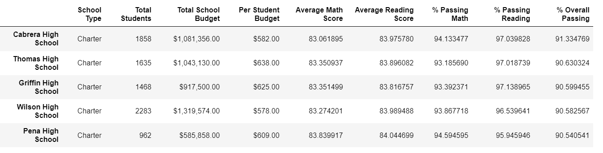
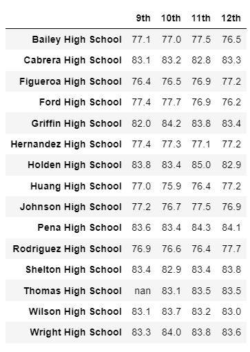
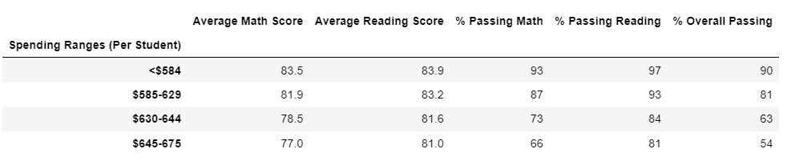
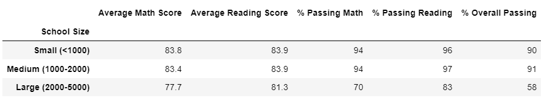
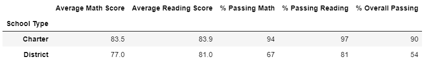

# School District Analysis

## Overview of the school district analysis
Standardized testing information and funding for a school district from a variety of sources has been provided in order to analyze performance trends and patterns. These will be used to inform discussions at the school board and superintendent levels to make strategic decisions regarding budgets and priorities. However, there is question regarding the itegrity of the data, specifically for Thomas High School, 9th grade results. The requested process requires excluding said grades, by assigning NaN (not-a-number) values, and perform a new analysis.

## Results
The data has been aggregated to show trends in school performance.

- **How is the district summary affected?** The average reading score remains the same, and the average math score has been reduced by a tenth of a percent point. The overall passing percentage has also been reduced by a tenth of a percent. Similarly, the percentage of passing grades for both subjects, differ by two and three tenths of a percentage.

*Original district summary.*

*District summary after excluding Thomas H.S. 9th grade*
- **How is the school summary affected?** For Thomas H.S., the average scores have changed by less than 1%. The same goes for the percentage of passing on both subjects.
- **How does replacing the ninth graders’ math and reading scores affect Thomas High School’s performance relative to the other schools?** Thomas High School has remained in the same place as before, being the second best performing school.

*Dataframe of top 5 performing schools after excluding Thomas H.S. 9th grade*
- **How does replacing the ninth-grade scores affect the following:**
    - **Math and reading scores by grade** The scores per grade for each school are unaffected, except for Thomas H.S. 9th grade, which are unreported (listed as NaN)
    
*Dataframe of math scores per grade, after excluding Thomas H.S. 9th grade*
    - **Scores by school spending** The average scores per spend have remained unchanged for all ranges.
    
*Dataframe of scores per student-spend ranges before and after exclusion*
    - **Scores by school size** The scores by school size have remain unchanged.
    
    *Dataframe of scores by school size before and after exclusion.*
    - **Scores by school type** The scores by school type have remained unchanged after exclusion.
    
    *Dataframe of scores by school type before and after exclusion.*

## Summary
The following changes to the reported results are observed after excluding the 9th grade scores for Tomas High School:
- The average scores per grade for Thomas H.S. now are unreported.
- The average math score for the district has been reduced by about a tenth of a percent.
- The percentage of passing students for math for the district has been reduced by about two tenths of a percent.
- The percentage of passing students for reading for the district has been reduced by about three tenths of a percent.
- The percentage of overall passing for the district has been reduced by about one tenth of a percent.

These changes are not statistically significant to indicate issues with the 9th grade data for Thomas High School.
